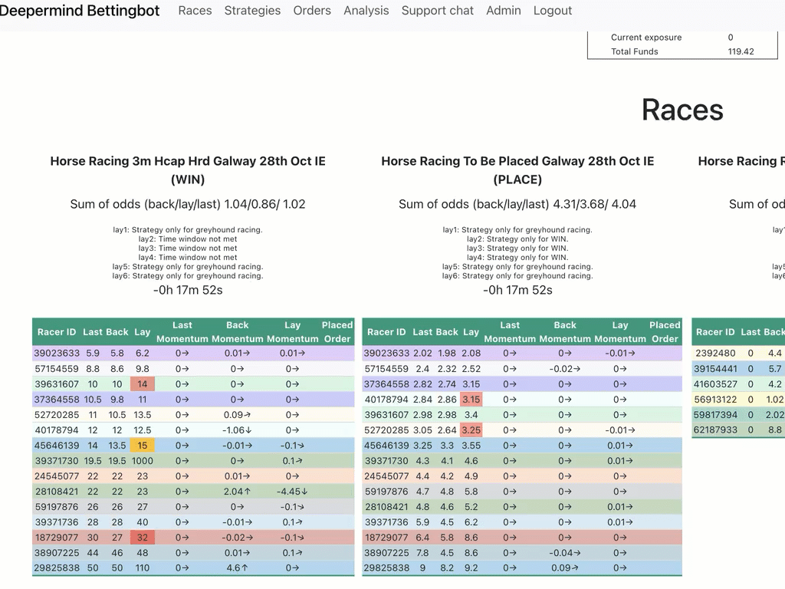

Betfair Bot React Frontend
==========================
The code is the frontend for the Betfair bot. It is written in React and uses Vite as the bundler.

Installation
------------
* Clone the repo
* Run `npm install`
* Run `npm run dev` to start the vite server

Project structure
-----------------

* `src` - contains the source code
* `src/components` - contains the React components
* `src/components/StrategyEditor` - contains the strategy editor
* `src/components/auth` - contains the authentication components
* `src/views` - contains the pages
* `src/routes` - contains the routes
* `src/assets` - contains the images, fonts, etc.

Race view
---------

You can select between multiple views to see current and upcoming races.

.. figure:: docs/view2.gif

Strategy Editor
---------------

The strategy editor allows you to create strategies for automated betting, using the metadata about the different runners.

.. figure:: docs/strategy.gif

Analysis
--------

You can analyze the outcome of the bets. The orders page offers filtering mechanisms and the Analysis page allows you to pivot the reults.

.. figure:: docs/analysis.gif

.. figure:: docs/orders.gif